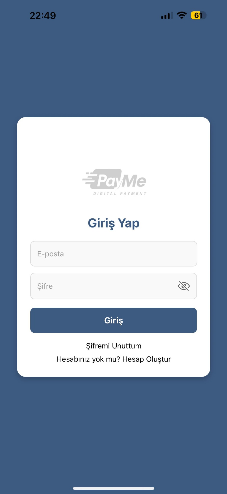
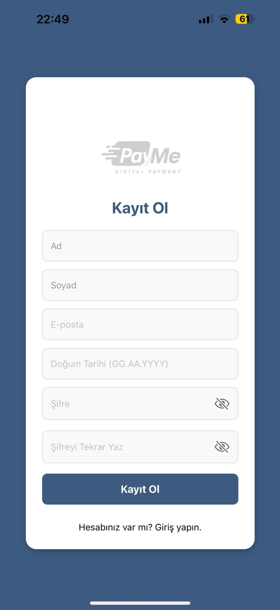
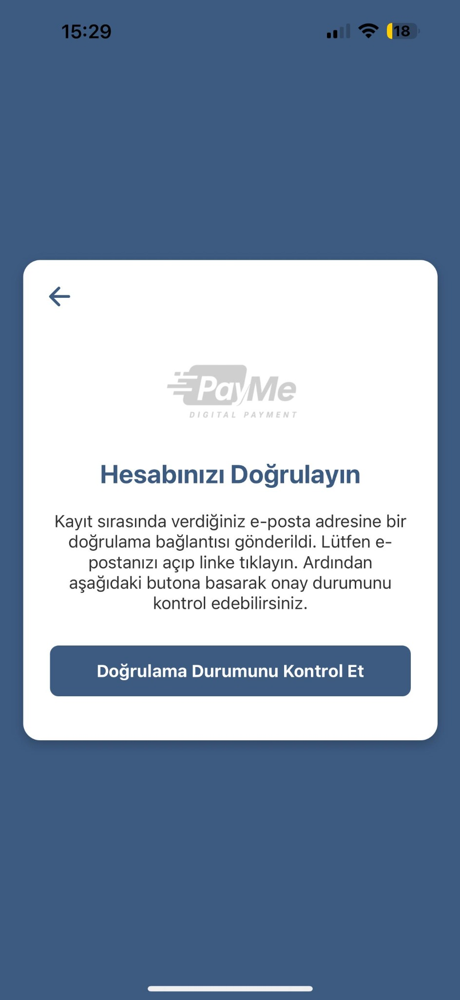
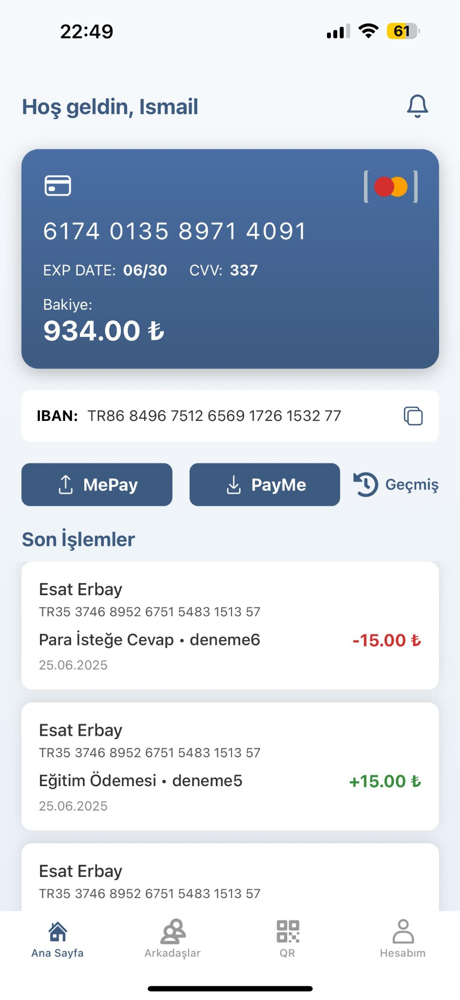
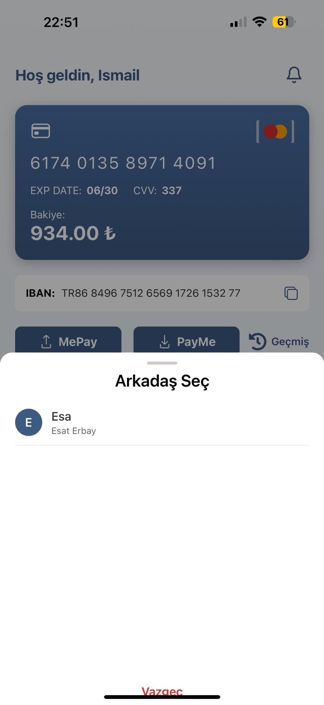
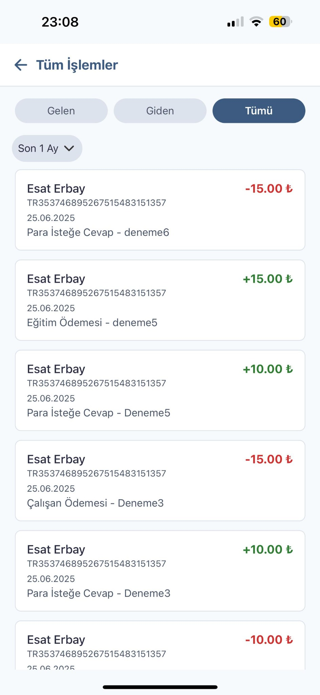
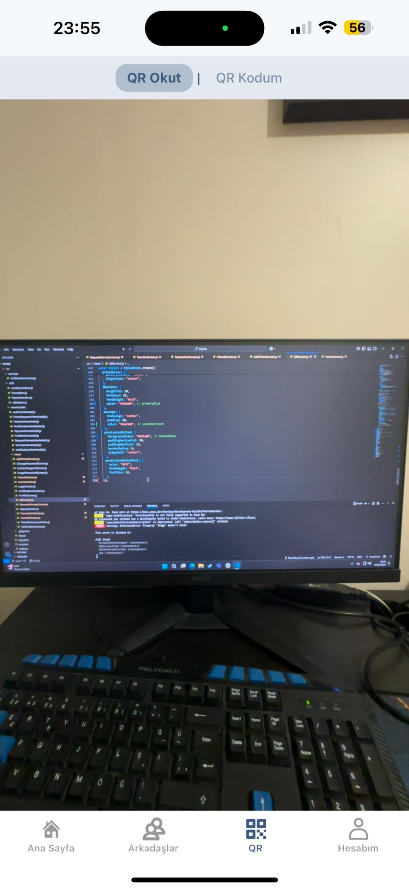
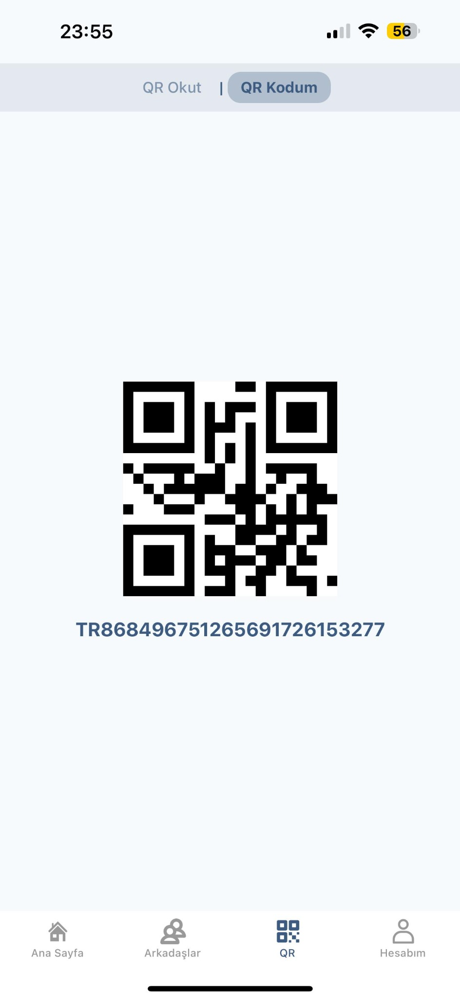

💸 PayMe – React Native Mobil Ödeme Uygulaması
🎓 Bitirme Projesi

  PayMe, kullanıcıların dijital ortamda para gönderme, ödeme alma ve QR kod aracılığıyla işlem yapma imkânı sunan modern bir mobil ödeme uygulamasıdır.
  Bu proje, bitirme projem olarak geliştirilmiş olup React Native ve Firebase teknolojileri kullanılarak hem iOS hem Android platformlarında çalışacak şekilde tasarlanmıştır.
  Amaç, kullanıcı dostu bir arayüzle gerçek zamanlı ödeme simülasyonu oluşturmaktır.

  🖼️ Uygulama Görselleri
  
    
 
    
 
    

  💡 Görseller: Giriş, kayıt, doğrulama, ana sayfa, arkadaş listesi, işlem geçmişi ve QR ödeme ekranları.

⚙️ Kullanılan Teknolojiler

  React Native (Expo) – Mobil uygulama geliştirme
  
  JavaScript (ES6+) – İş mantığı ve state yönetimi
  
  Firebase Authentication & Firestore – Kullanıcı doğrulama ve gerçek zamanlı veritabanı
  
  React Navigation – Sayfa geçişleri ve yönlendirme
  
  MVVM Mimarisi – Temiz, ölçeklenebilir yapı
  
  Notification Service – Gerçek zamanlı bildirim sistemi
  
  QR Code Entegrasyonu – Hızlı ve güvenli ödeme paylaşımı

📱 Özellikler

  🔐 Kullanıcı Kayıt ve Giriş Sistemi (Firebase Auth)
  
  ✉️ E-posta Doğrulama Süreci
  
  💸 Para Gönderme / Ödeme İsteği Gönderme
  
  📷 QR Kod ile Gönderim ve Alım
  
  👥 Arkadaş Yönetimi (ekleme, silme, düzenleme)
  
  🔔 Bildirim Sistemi
  
  📊 İşlem Geçmişi ve Filtreleme
  
  🌗 Modern ve sade mobil arayüz

🧩 Proje Mimarisi
  src/
   ┣ 📁 models/          → Veri modelleri
   ┣ 📁 navigation/      → Yönlendirme yapısı
   ┣ 📁 services/        → Firebase, bildirim ve yardımcı servisler
   ┣ 📁 utils/           → Yardımcı fonksiyonlar
   ┣ 📁 viewmodels/      → MVVM katmanı (iş mantığı)
   ┣ 📁 views/           → Ekranlar (Login, Signup, Transfer, QR, Profile, vb.)
   ┗ 📄 App.js           → Uygulama giriş noktası

🚀 Kurulum ve Çalıştırma

  Depoyu klonla:
  
  git clone https://github.com/essater/PayMe.git
  
  
  Dizine gir ve bağımlılıkları yükle:
  
  cd PayMe
  npm install
  
  
  Expo’yu başlat:
  
  npx expo start

  Mobil cihazında veya emülatörde uygulamayı test et. 📱

🎯 Projenin Amacı

Bu proje, mobil ödeme sistemlerinin temel mimarisini, kullanıcı doğrulama süreçlerini ve
gerçek zamanlı veri yönetimini anlamak amacıyla geliştirilmiştir. Geliştirme sürecinde; React Native, Firebase, form doğrulama, bildirim servisleri ve QR tabanlı işlemler üzerine derinlemesine pratik yapılmıştır.

🔮 Geliştirme Fikirleri

  Gerçek ödeme API entegrasyonu (Stripe / PayPal)
  
  Push notification sistemi
  
  Karanlık tema desteği
  
  Çoklu dil desteği (i18n)
  
  Profil fotoğrafı ve kişiselleştirme

👨‍💻 Geliştirici

  İsmail Esat Erbay
  🎓 Bitirme Projesi | Frontend & Mobile Developer

🏷️ Lisans

  Bu proje eğitim ve portföy amacıyla geliştirilmiştir.
  Ticari amaçlarla kullanılamaz veya dağıtılamaz.
